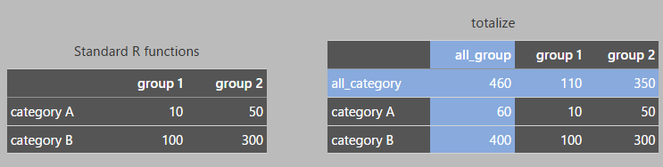

<!-- README-ja.md is generated from README-ja.Rmd. Do not edit README-ja.md directly. -->

# totalize

<!-- badges: start -->

<!-- badges: end -->

集計表を作成し、小計・合計を計算するパッケージ

## インストール

次のコマンドでGitHubからインストールできます。

``` r
devtools::install_github("ichiromurata/totalize")
```

## TL;DR



## 概要

Rにはデータを集計する様々な関数があります。

`datasets::CO2`のデータを例に取りましょう。データ数のカウントは`table()`で行えます。

``` r
table(interaction(datasets::CO2$Type, datasets::CO2$Treatment))
#> 
#>      Quebec.nonchilled Mississippi.nonchilled         Quebec.chilled    Mississippi.chilled 
#>                     21                     21                     21                     21
```

値の足し上げには`tapply()`、`stats::xtabs()`、

``` r
tapply(datasets::CO2$uptake, datasets::CO2[c("Type", "Treatment")], FUN=sum)
#>              Treatment
#> Type          nonchilled chilled
#>   Quebec             742   666.8
#>   Mississippi        545   332.1

stats::xtabs(uptake~Type+Treatment, data=datasets::CO2)
#>              Treatment
#> Type          nonchilled chilled
#>   Quebec           742.0   666.8
#>   Mississippi      545.0   332.1
```

あるいは`stats::aggregate()`を使うことができます。

``` r
stats::aggregate(datasets::CO2["uptake"], datasets::CO2[c("Type", "Treatment")], sum)
#>          Type  Treatment uptake
#> 1      Quebec nonchilled  742.0
#> 2 Mississippi nonchilled  545.0
#> 3      Quebec    chilled  666.8
#> 4 Mississippi    chilled  332.1
```

しかしこれらの関数は各グループの小計や合計（上の例では”Type”計、“Treatment”計、合計）までを一度に算出することはできません。
そのような異なる階層の計算を行うには、別々に関数を実行する必要があります。

`totalize`はこれをまとめて一度に行います。

``` r
library(totalize)
totalize(datasets::CO2, c(Type, Treatment), val=uptake, asDF=TRUE)
#>          Type     Treatment uptake
#> 1    all_Type all_Treatment 2285.9
#> 2    all_Type    nonchilled 1287.0
#> 3    all_Type       chilled  998.9
#> 4      Quebec all_Treatment 1408.8
#> 5      Quebec    nonchilled  742.0
#> 6      Quebec       chilled  666.8
#> 7 Mississippi all_Treatment  877.1
#> 8 Mississippi    nonchilled  545.0
#> 9 Mississippi       chilled  332.1
```

さらに、2次元の集計表に展開することができます。

``` r
totalize(datasets::CO2, row=Type, col=Treatment, val=uptake)
#>              Treatment
#> Type          all_Treatment nonchilled chilled
#>   all_Type           2285.9       1287   998.9
#>   Quebec             1408.8        742   666.8
#>   Mississippi         877.1        545   332.1
```

3つ以上の変数があるときは、行あるいは列に組み合わせを作って2次元の集計表を作成します。

``` r
totalize(datasets::CO2, row=Type, col=c(Treatment, conc), val=uptake)
#>              Treatment,conc
#> Type          all_Treatment|all_conc all_Treatment|95 all_Treatment|175 all_Treatment|250 all_Treatment|350 all_Treatment|500 all_Treatment|675 all_Treatment|1000 nonchilled|all_conc nonchilled|95 nonchilled|175 nonchilled|250 nonchilled|350 nonchilled|500 nonchilled|675 nonchilled|1000 chilled|all_conc chilled|95 chilled|175 chilled|250 chilled|350 chilled|500 chilled|675 chilled|1000
#>   all_Type                    2285.9            147.1             267.4             346.5             368.0             370.5             383.4                403                1287          79.7          150.7          194.8          210.8          210.6          216.1           224.3            998.9       67.4       116.7       151.7       157.2       159.9       167.3        178.7
#>   Quebec                      1408.8             84.4             162.5             215.6             228.5             228.8             237.0                252                 742          45.8           90.1          112.2          121.1          118.8          124.5           129.5            666.8       38.6        72.4       103.4       107.4       110.0       112.5        122.5
#>   Mississippi                  877.1             62.7             104.9             130.9             139.5             141.7             146.4                151                 545          33.9           60.6           82.6           89.7           91.8           91.6            94.8            332.1       28.8        44.3        48.3        49.8        49.9        54.8         56.2

totalize(datasets::CO2, row=c(Type, conc), col=Treatment, val=uptake)
#>                       Treatment
#> Type,conc              all_Treatment nonchilled chilled
#>   all_Type|all_conc           2285.9     1287.0   998.9
#>   all_Type|95                  147.1       79.7    67.4
#>   all_Type|175                 267.4      150.7   116.7
#>   all_Type|250                 346.5      194.8   151.7
#>   all_Type|350                 368.0      210.8   157.2
#>   all_Type|500                 370.5      210.6   159.9
#>   all_Type|675                 383.4      216.1   167.3
#>   all_Type|1000                403.0      224.3   178.7
#>   Quebec|all_conc             1408.8      742.0   666.8
#>   Quebec|95                     84.4       45.8    38.6
#>   Quebec|175                   162.5       90.1    72.4
#>   Quebec|250                   215.6      112.2   103.4
#>   Quebec|350                   228.5      121.1   107.4
#>   Quebec|500                   228.8      118.8   110.0
#>   Quebec|675                   237.0      124.5   112.5
#>   Quebec|1000                  252.0      129.5   122.5
#>   Mississippi|all_conc         877.1      545.0   332.1
#>   Mississippi|95                62.7       33.9    28.8
#>   Mississippi|175              104.9       60.6    44.3
#>   Mississippi|250              130.9       82.6    48.3
#>   Mississippi|350              139.5       89.7    49.8
#>   Mississippi|500              141.7       91.8    49.9
#>   Mississippi|675              146.4       91.6    54.8
#>   Mississippi|1000             151.0       94.8    56.2
```

集計する際に`NA`を無視するには、`na.rm=TRUE`などを`FUN`で指定する関数の引数に追加できます。

``` r
# Missing values turn the totals into NA
totalize(datasets::penguins, species, island, val=body_mass, FUN=sum)
#>              island
#> species       all_island Biscoe  Dream Torgersen
#>   all_species         NA     NA 460400        NA
#>   Adelie              NA 163225 206550        NA
#>   Chinstrap       253850     NA 253850        NA
#>   Gentoo              NA     NA     NA        NA

# Ignoring NAs
totalize(datasets::penguins, species, island, val=body_mass, FUN=sum, na.rm=TRUE)
#>              island
#> species       all_island Biscoe  Dream Torgersen
#>   all_species    1437000 787575 460400    189025
#>   Adelie          558800 163225 206550    189025
#>   Chinstrap       253850     NA 253850        NA
#>   Gentoo          624350 624350     NA        NA
```

## 分類不詳の扱い

データによってはグループ変数の値に不詳（欠測）を含む場合があります。これを集計するときは「不詳」や「分類不能」として明示的に集計表に示すこともありますが、集計表には表示しないこともしばしばあります。

このような場合に小計や合計を計算するには注意が必要です。グループごとに集計した結果を内訳として足し上げるだけでは、小計や合計から不詳のデータが除かれてしまいます。`totalize`はこれに対処するために小計や合計を全てのデータから計算しています。

下の例では[palmerpenguins](https://allisonhorst.github.io/palmerpenguins/)のデータセットの`sex`列に不詳（`NA`）が含まれることから、femaleとmaleの計が小計と一致しないことを示しています。

``` r
# Correctly count the total that does not match the sum of female + male
totalize(datasets::penguins, species, sex)
#>              sex
#> species       all_sex female male
#>   all_species     344    165  168
#>   Adelie          152     73   73
#>   Chinstrap        68     34   34
#>   Gentoo          124     58   61

# `addmargins()` excludes the unclassified data
xtabs(~species+sex, data=datasets::penguins) |>
  addmargins()
#>            sex
#> species     female male Sum
#>   Adelie        73   73 146
#>   Chinstrap     34   34  68
#>   Gentoo        58   61 119
#>   Sum          165  168 333
```

## 1行（1列）のみの表

`totailze`は1列のみの表も作成できます。

``` r
totalize(datasets::CO2, row=c(Type, Treatment), val=uptake)
#>                            
#> Type,Treatment              uptake
#>   all_Type|all_Treatment    2285.9
#>   all_Type|nonchilled       1287.0
#>   all_Type|chilled           998.9
#>   Quebec|all_Treatment      1408.8
#>   Quebec|nonchilled          742.0
#>   Quebec|chilled             666.8
#>   Mississippi|all_Treatment  877.1
#>   Mississippi|nonchilled     545.0
#>   Mississippi|chilled        332.1
```

1行のみの表を作る場合は、上の表を転置`t()`してください。

``` r
totalize(datasets::CO2, row=c(Type, Treatment), val=uptake) |> t()
#>         Type,Treatment
#>          all_Type|all_Treatment all_Type|nonchilled all_Type|chilled Quebec|all_Treatment Quebec|nonchilled Quebec|chilled Mississippi|all_Treatment Mississippi|nonchilled Mississippi|chilled
#>   uptake                 2285.9                1287            998.9               1408.8               742          666.8                     877.1                    545               332.1
```

## Non standard evaluation (NSE)

変数の名前はダブルクォーテーションで囲まずにそのまま渡すことができます。（Non-standard
evaluation）

# 四捨五入について

このパッケージでは四捨五入を行う関数`awayfromzero()`を提供しています。

Rの`round()`関数は四捨五入ではなく偶数丸めを行います。四捨五入の関数はbase
Rには含まれていません。

`awayfromzero()`は浮動小数点形式の有効桁数の問題に対処するため、入力された数の桁数に応じて切り上げと切り下げを判定する精度を変化させています。

四捨五入はパイプ演算子`|>`で結んで実行できます。

``` r
totalize(datasets::CO2, row=c(Treatment, conc), col=Type, val=uptake, FUN=mean) |>
    awayfromzero(digits = 1)
#>                         Type
#> Treatment,conc           all_Type Quebec Mississippi
#>   all_Treatment|all_conc     27.2   33.5        20.9
#>   all_Treatment|95           12.3   14.1        10.5
#>   all_Treatment|175          22.3   27.1        17.5
#>   all_Treatment|250          28.9   35.9        21.8
#>   all_Treatment|350          30.7   38.1        23.3
#>   all_Treatment|500          30.9   38.1        23.6
#>   all_Treatment|675          32.0   39.5        24.4
#>   all_Treatment|1000         33.6   42.0        25.2
#>   nonchilled|all_conc        30.6   35.3        26.0
#>   nonchilled|95              13.3   15.3        11.3
#>   nonchilled|175             25.1   30.0        20.2
#>   nonchilled|250             32.5   37.4        27.5
#>   nonchilled|350             35.1   40.4        29.9
#>   nonchilled|500             35.1   39.6        30.6
#>   nonchilled|675             36.0   41.5        30.5
#>   nonchilled|1000            37.4   43.2        31.6
#>   chilled|all_conc           23.8   31.8        15.8
#>   chilled|95                 11.2   12.9         9.6
#>   chilled|175                19.5   24.1        14.8
#>   chilled|250                25.3   34.5        16.1
#>   chilled|350                26.2   35.8        16.6
#>   chilled|500                26.7   36.7        16.6
#>   chilled|675                27.9   37.5        18.3
#>   chilled|1000               29.8   40.8        18.7
```
