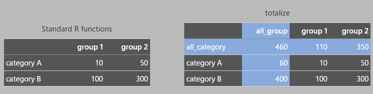

<!-- README.md is generated from README.Rmd. Do not edit README.md directly. -->

# totalize

<!-- badges: start -->

<!-- badges: end -->

[日本語版はこちら](README-ja.md) (README in Japanese)

Aggregate values by specified groups and adds their group totals

## Installation

You can install `totalize` directly from its GitHub repository:

``` r
devtools::install_github("ichiromurata/totalize")
```

## TL;DR



## How this works

Standard R functions provide several methods for data aggregation.

For instance, using `datasets::CO2` as an example, you can count data
with `table()`:

``` r
table(datasets::CO2$Type, datasets::CO2$Treatment)
#>              
#>               nonchilled chilled
#>   Quebec              21      21
#>   Mississippi         21      21
```

Alternatively, you can sum values using `tapply()`, `stats::xtabs()`,

``` r
tapply(datasets::CO2$uptake, datasets::CO2[c("Type", "Treatment")], FUN=sum)
#>              Treatment
#> Type          nonchilled chilled
#>   Quebec             742   666.8
#>   Mississippi        545   332.1

stats::xtabs(uptake~Type+Treatment, data=datasets::CO2)
#>              Treatment
#> Type          nonchilled chilled
#>   Quebec           742.0   666.8
#>   Mississippi      545.0   332.1
```

or `stats::aggregate()`.

``` r
stats::aggregate(datasets::CO2["uptake"], datasets::CO2[c("Type", "Treatment")], sum)
#>          Type  Treatment uptake
#> 1      Quebec nonchilled  742.0
#> 2 Mississippi nonchilled  545.0
#> 3      Quebec    chilled  666.8
#> 4 Mississippi    chilled  332.1
```

However, a common limitation of these functions is that they do not
compute subtotals (e.g., by ‘Type’ or ‘Treatment’) and the grand total
in a single step. Calculating these different levels of aggregation
typically requires additional, separate operations, as the functions are
not designed to consolidate them into a unified output.

`totalize` streamlines this entire process into a single command:

``` r
library(totalize)
totalize(datasets::CO2, c(Type, Treatment), val=uptake, asDF=TRUE)
#>          Type     Treatment uptake
#> 1    all_Type all_Treatment 2285.9
#> 2    all_Type    nonchilled 1287.0
#> 3    all_Type       chilled  998.9
#> 4      Quebec all_Treatment 1408.8
#> 5      Quebec    nonchilled  742.0
#> 6      Quebec       chilled  666.8
#> 7 Mississippi all_Treatment  877.1
#> 8 Mississippi    nonchilled  545.0
#> 9 Mississippi       chilled  332.1
```

Furthermore, `totalize` can produce a neatly arranged matrix
representation of the results:

``` r
totalize(datasets::CO2, row=Type, col=Treatment, val=uptake)
#>              Treatment
#> Type          all_Treatment nonchilled chilled
#>   all_Type           2285.9       1287   998.9
#>   Quebec             1408.8        742   666.8
#>   Mississippi         877.1        545   332.1
```

When grouping by three or more variables, `totalize` organizes the
output into a 2-dimensional matrix by creating combined group labels for
clarity:

``` r
totalize(datasets::CO2, row=Type, col=c(Treatment, conc), val=uptake)
#>              Treatment,conc
#> Type          all_Treatment|all_conc all_Treatment|95 all_Treatment|175 all_Treatment|250 all_Treatment|350 all_Treatment|500 all_Treatment|675 all_Treatment|1000 nonchilled|all_conc nonchilled|95 nonchilled|175 nonchilled|250 nonchilled|350 nonchilled|500 nonchilled|675 nonchilled|1000 chilled|all_conc chilled|95 chilled|175 chilled|250 chilled|350 chilled|500 chilled|675 chilled|1000
#>   all_Type                    2285.9            147.1             267.4             346.5             368.0             370.5             383.4                403                1287          79.7          150.7          194.8          210.8          210.6          216.1           224.3            998.9       67.4       116.7       151.7       157.2       159.9       167.3        178.7
#>   Quebec                      1408.8             84.4             162.5             215.6             228.5             228.8             237.0                252                 742          45.8           90.1          112.2          121.1          118.8          124.5           129.5            666.8       38.6        72.4       103.4       107.4       110.0       112.5        122.5
#>   Mississippi                  877.1             62.7             104.9             130.9             139.5             141.7             146.4                151                 545          33.9           60.6           82.6           89.7           91.8           91.6            94.8            332.1       28.8        44.3        48.3        49.8        49.9        54.8         56.2

totalize(datasets::CO2, row=c(Type, conc), col=Treatment, val=uptake)
#>                       Treatment
#> Type,conc              all_Treatment nonchilled chilled
#>   all_Type|all_conc           2285.9     1287.0   998.9
#>   all_Type|95                  147.1       79.7    67.4
#>   all_Type|175                 267.4      150.7   116.7
#>   all_Type|250                 346.5      194.8   151.7
#>   all_Type|350                 368.0      210.8   157.2
#>   all_Type|500                 370.5      210.6   159.9
#>   all_Type|675                 383.4      216.1   167.3
#>   all_Type|1000                403.0      224.3   178.7
#>   Quebec|all_conc             1408.8      742.0   666.8
#>   Quebec|95                     84.4       45.8    38.6
#>   Quebec|175                   162.5       90.1    72.4
#>   Quebec|250                   215.6      112.2   103.4
#>   Quebec|350                   228.5      121.1   107.4
#>   Quebec|500                   228.8      118.8   110.0
#>   Quebec|675                   237.0      124.5   112.5
#>   Quebec|1000                  252.0      129.5   122.5
#>   Mississippi|all_conc         877.1      545.0   332.1
#>   Mississippi|95                62.7       33.9    28.8
#>   Mississippi|175              104.9       60.6    44.3
#>   Mississippi|250              130.9       82.6    48.3
#>   Mississippi|350              139.5       89.7    49.8
#>   Mississippi|500              141.7       91.8    49.9
#>   Mississippi|675              146.4       91.6    54.8
#>   Mississippi|1000             151.0       94.8    56.2
```

To ignore `NA` values when aggregating, simply pass arguments like
`na.rm=TRUE` to the aggregation function (`FUN`):

``` r
# Missing values turn the totals into NA
totalize(datasets::penguins, species, island, val=body_mass, FUN=sum)
#>              island
#> species       all_island Biscoe  Dream Torgersen
#>   all_species         NA     NA 460400        NA
#>   Adelie              NA 163225 206550        NA
#>   Chinstrap       253850     NA 253850        NA
#>   Gentoo              NA     NA     NA        NA

# Ignoring NAs
totalize(datasets::penguins, species, island, val=body_mass, FUN=sum, na.rm=TRUE)
#>              island
#> species       all_island Biscoe  Dream Torgersen
#>   all_species    1437000 787575 460400    189025
#>   Adelie          558800 163225 206550    189025
#>   Chinstrap       253850     NA 253850        NA
#>   Gentoo          624350 624350     NA        NA
```

## Handling Unclassified Data

In many datasets, some records may not be assigned to a category in a
grouping variable (i.e., they have NA values). While these
“unclassified” items don’t belong to a specific group, they are
essential for calculating accurate overall totals.

A common pitfall is to calculate a grand total by summing previously
calculated group totals. This approach incorrectly excludes the
unclassified items. To ensure accuracy, `totalize` always re-aggregates
from the original, unfiltered data when computing subtotals and the
grand total, thereby correctly including all entries.

For instance, in the
[palmerpenguins](https://allisonhorst.github.io/palmerpenguins/)
dataset, the sum of “female” and “male” does not equal the total number
of penguins because some have an unspecified sex. `totalize` accounts
for this discrepancy:

``` r
# Correctly count the total that does not match the sum of female + male
totalize(datasets::penguins, species, sex)
#>              sex
#> species       all_sex female male
#>   all_species     344    165  168
#>   Adelie          152     73   73
#>   Chinstrap        68     34   34
#>   Gentoo          124     58   61

# `addmargins()` excludes the unclassified data
xtabs(~species+sex, data=datasets::penguins) |>
  addmargins()
#>            sex
#> species     female male Sum
#>   Adelie        73   73 146
#>   Chinstrap     34   34  68
#>   Gentoo        58   61 119
#>   Sum          165  168 333
```

## Single row or column matrix

`totalize` can also produce a single-column matrix when only row
groupings are specified:

``` r
totalize(datasets::CO2, row=c(Type, Treatment), val=uptake)
#>                            
#> Type,Treatment              uptake
#>   all_Type|all_Treatment    2285.9
#>   all_Type|nonchilled       1287.0
#>   all_Type|chilled           998.9
#>   Quebec|all_Treatment      1408.8
#>   Quebec|nonchilled          742.0
#>   Quebec|chilled             666.8
#>   Mississippi|all_Treatment  877.1
#>   Mississippi|nonchilled     545.0
#>   Mississippi|chilled        332.1
```

To obtain a single-row matrix, you can easily transpose the result using
the `t()` function:

``` r
totalize(datasets::CO2, row=c(Type, Treatment), val=uptake) |> t()
#>         Type,Treatment
#>          all_Type|all_Treatment all_Type|nonchilled all_Type|chilled Quebec|all_Treatment Quebec|nonchilled Quebec|chilled Mississippi|all_Treatment Mississippi|nonchilled Mississippi|chilled
#>   uptake                 2285.9                1287            998.9               1408.8               742          666.8                     877.1                    545               332.1
```

## Non standard evaluation (NSE)

The `row`, `col`, and `val` parameters support ‘non-standard evaluation’
(NSE). This means you can refer to column names directly, without
needing to enclose them in quotes.

# Rounding numbers

This package provides an `awayfromzero()` method for rounding, which
rounds halves [away from
zero](https://en.wikipedia.org/wiki/Rounding#Round_half_away_from_zero).

`awayfromzero()` is designed to address floating-point precision issues
by dynamically scaling its rounding tolerance based on the magnitude of
the input number.

This rounding function can be conveniently chained with other operations
using the pipe operator `|>`.

``` r
totalize(datasets::CO2, row=c(Treatment, conc), col=Type, val=uptake, FUN=mean) |>
    awayfromzero(digits = 1)
#>                         Type
#> Treatment,conc           all_Type Quebec Mississippi
#>   all_Treatment|all_conc     27.2   33.5        20.9
#>   all_Treatment|95           12.3   14.1        10.5
#>   all_Treatment|175          22.3   27.1        17.5
#>   all_Treatment|250          28.9   35.9        21.8
#>   all_Treatment|350          30.7   38.1        23.3
#>   all_Treatment|500          30.9   38.1        23.6
#>   all_Treatment|675          32.0   39.5        24.4
#>   all_Treatment|1000         33.6   42.0        25.2
#>   nonchilled|all_conc        30.6   35.3        26.0
#>   nonchilled|95              13.3   15.3        11.3
#>   nonchilled|175             25.1   30.0        20.2
#>   nonchilled|250             32.5   37.4        27.5
#>   nonchilled|350             35.1   40.4        29.9
#>   nonchilled|500             35.1   39.6        30.6
#>   nonchilled|675             36.0   41.5        30.5
#>   nonchilled|1000            37.4   43.2        31.6
#>   chilled|all_conc           23.8   31.8        15.8
#>   chilled|95                 11.2   12.9         9.6
#>   chilled|175                19.5   24.1        14.8
#>   chilled|250                25.3   34.5        16.1
#>   chilled|350                26.2   35.8        16.6
#>   chilled|500                26.7   36.7        16.6
#>   chilled|675                27.9   37.5        18.3
#>   chilled|1000               29.8   40.8        18.7
```
